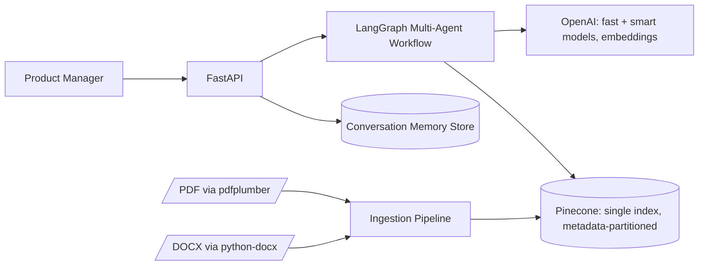
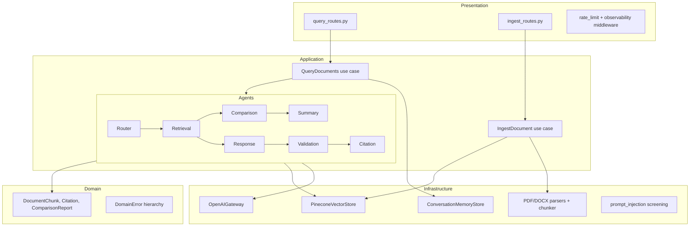
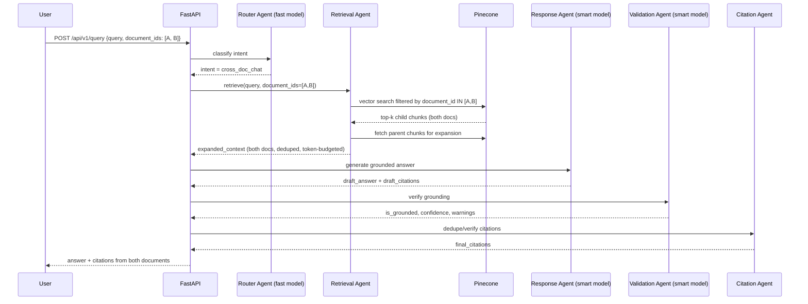
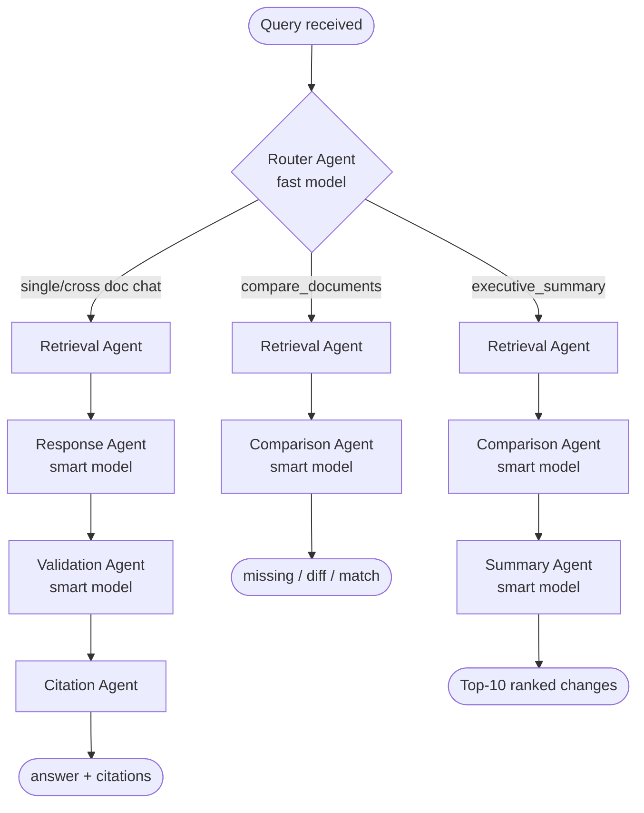
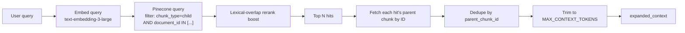
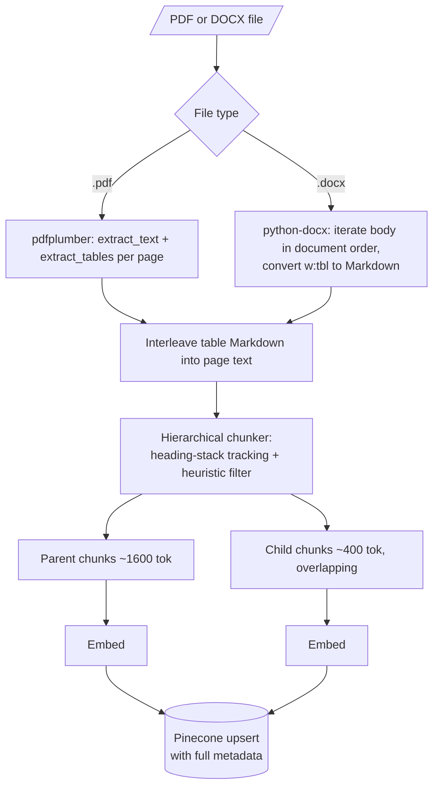
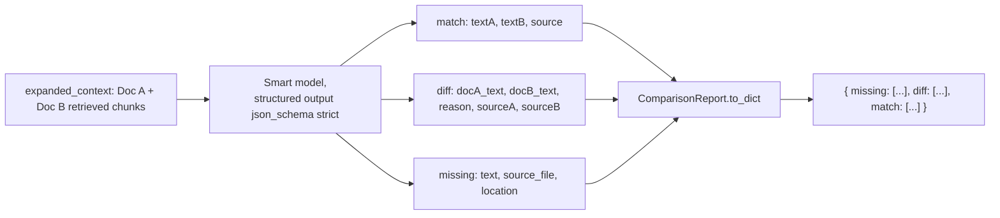
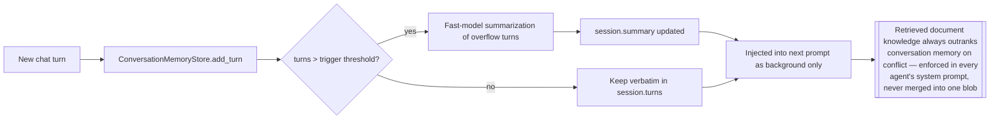
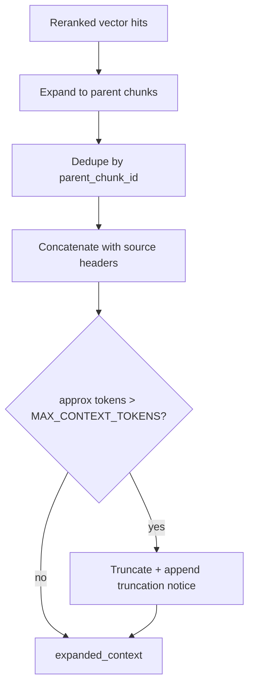
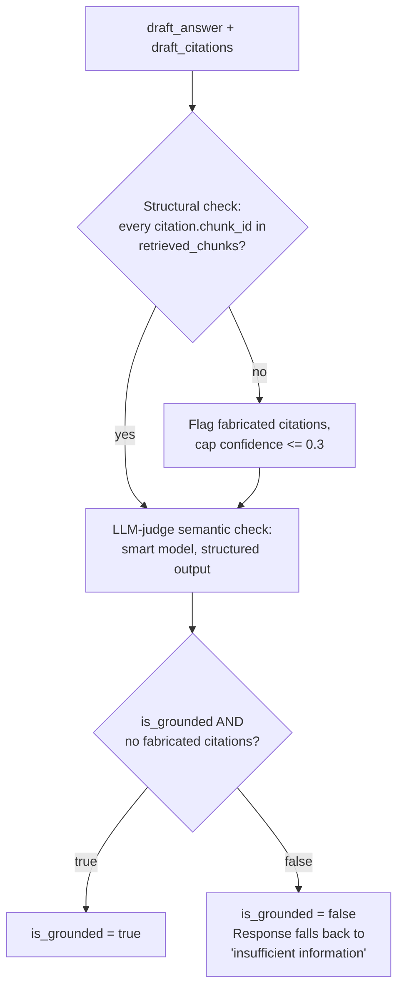

# System Architecture Diagrams

## High-Level Diagram

## Component Diagram

## Sequence Diagram — Cross-Document Chat

## Agent Flow

## Retrieval Flow (Parent-Child + Dual-Document)

## Document Ingestion Flow

## Comparison Flow

## Memory Flow

## Context Flow

## Validation Flow

