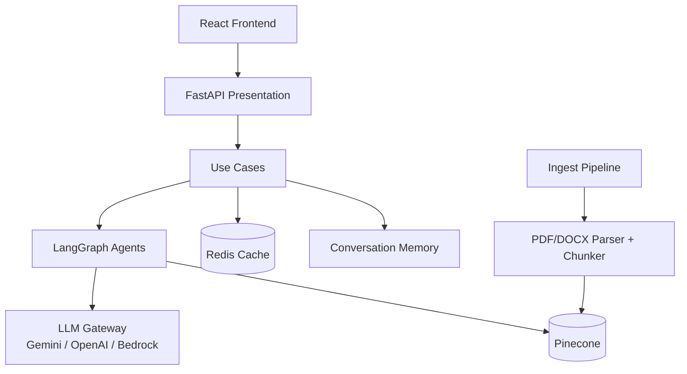
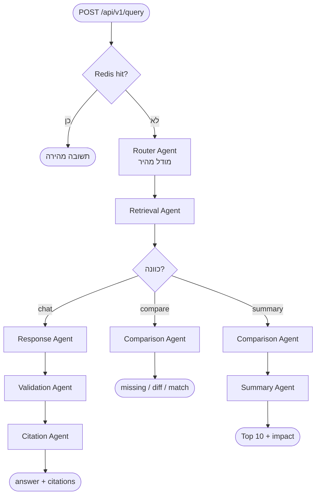

# FDS AI Platform — ארכיטקטורה ומדריך Backend (v1)

מסמך זה מתאר את הארכיטקטורה של המערכת, זרימת העבודה מקצה לקצה, ותפקיד **כל קובץ בבקאנד** בתוך התהליך.

---

## 1. מה המערכת עושה

מערכת Enterprise GenAI להשוואת מסמכי FDS (Functional Design Spec):

1. **השוואת מסמכים** — פלט מובנה `{ missing, diff, match }` + similarity מספרי
2. **צ׳אט על מסמך בודד** — RAG עם citations (מסמך / סעיף / עמוד)
3. **צ׳אט חוצה-מסמכים** — שאלות "מה השתנה?" משני המסמכים
4. **סיכום מנהלים** — Top 10 שינויים מדורגים לפי חשיבות עסקית

**Stack:** FastAPI · LangGraph · Gemini/OpenAI/Bedrock · Pinecone · Redis · React

---

## 2. ארכיטקטורה בשכבות (Clean Architecture)

```
┌─────────────────────────────────────────────────────────────┐
│  Presentation   — FastAPI routes + middleware                │
├─────────────────────────────────────────────────────────────┤
│  Application    — Use cases + LangGraph agents               │
├─────────────────────────────────────────────────────────────┤
│  Domain         — ישויות עסקיות + שגיאות (ללא תלות חיצונית) │
├─────────────────────────────────────────────────────────────┤
│  Infrastructure — LLM, Pinecone, parsers, Redis, security    │
└─────────────────────────────────────────────────────────────┘
```

**עקרון:** Controllers דקים → Use cases מכינים State → Agents מריצים לוגיקה → Infrastructure מבצעת I/O.



---

## 3. שני תהליכים מרכזיים

### 3.1 Ingest — טעינת מסמך

```
Upload PDF/DOCX
    → parse (עמודים + טבלאות כ-Markdown)
    → chunk (Parent/Child לפי כותרות)
    → embed
    → upsert ל-Pinecone (עם metadata: document, version, page, section, …)
```

### 3.2 Query — שאילתה (השוואה / צ׳אט / סיכום)

```
POST /api/v1/query
    → בדיקת Redis cache (hit → החזרה מיידית)
    → LangGraph:
         Router → Retrieval → [Comparison | Response→Validation→Citation]
                              └→ Summary (אם executive_summary)
    → שמירה ב-cache + זיכרון שיחה
    → תשובה ללקוח
```



---

## 4. מיפוי קבצי Backend — מה כל קובץ עושה בתהליך

נתיב הבסיס: `backend/app/`

### 4.1 נקודת כניסה

| קובץ | תפקיד בתהליך |
|------|----------------|
| [`main.py`](backend/app/main.py) | יוצר את אפליקציית FastAPI, מחבר middleware (CORS, rate-limit, observability), כולל את נתיבי ה-API, מגדיר handler לשגיאות 500 מחוטאות, ומספק `GET /health` (כולל מצב Redis / LLM / Pinecone). |

---

### 4.2 Presentation — API ו-Middleware

| קובץ | תפקיד בתהליך |
|------|----------------|
| [`presentation/api/v1/ingest_routes.py`](backend/app/presentation/api/v1/ingest_routes.py) | `POST /api/v1/ingest` — מקבל קובץ + `document_name` + `version`, שומר זמנית לדיסק, קורא ל-use case של ingest, מחזיר מספר chunks שנוצרו. |
| [`presentation/api/v1/query_routes.py`](backend/app/presentation/api/v1/query_routes.py) | `POST /api/v1/query` — נקודת כניסה אחידה לכל 4 ה-intents. מעביר ל-use case; ממפה ConfigurationError→503, DomainError→422. |
| [`presentation/middleware/rate_limit.py`](backend/app/presentation/middleware/rate_limit.py) | מגביל קצב בקשות (in-memory) כדי למנוע הצפה של ה-API / ה-LLM. |
| [`presentation/middleware/observability.py`](backend/app/presentation/middleware/observability.py) | מצמיד `request_id` לכל בקשה וכותב לוגים — מאפשר מעקב אחרי כשלים. |

---

### 4.3 Application — Use Cases (גבול בין API לגרף)

| קובץ | תפקיד בתהליך |
|------|----------------|
| [`application/use_cases/ingest_document.py`](backend/app/application/use_cases/ingest_document.py) | אורקסטרציית ingest: parse → chunk → embed → שמירה ב-Pinecone. מחזיר מטא-דאטה על המסמך. |
| [`application/use_cases/query_documents.py`](backend/app/application/use_cases/query_documents.py) | אורקסטרציית query: בודק cache → בונה `GraphState` → מריץ LangGraph → מעצב תשובה לפי intent → שומר cache + conversation memory. |
| [`application/dto/schemas.py`](backend/app/application/dto/schemas.py) | חוזי Pydantic ל-API: `QueryRequest` / `QueryResponse` / `IngestResponse` / `HealthResponse`. |

---

### 4.4 Application — סוכני LangGraph (לב המערכת)

| קובץ | תפקיד בתהליך |
|------|----------------|
| [`application/agents/graph.py`](backend/app/application/agents/graph.py) | מרכיב את ה-StateGraph: Router→Retrieval→(Comparison\|Response)… מגדיר את הניתוב בין הסוכנים. |
| [`application/agents/state.py`](backend/app/application/agents/state.py) | הגדרת `GraphState` — השדות שעוברים בין סוכנים (`user_query`, `intent`, `retrieved_chunks`, `comparison_report`, וכו׳). |
| [`application/agents/router_agent.py`](backend/app/application/agents/router_agent.py) | **שלב 1.** מסווג את השאילתה ל-intent אחד מתוך 4. רץ על מודל *fast*. גם מסנן prompt-injection גס. |
| [`application/agents/retrieval_agent.py`](backend/app/application/agents/retrieval_agent.py) | **שלב 2.** embed לשאילתה → חיפוש ב-Pinecone → rerank לקסיקלי → הרחבה ל-parent chunks → ניקוי כפילויות → חיתוך לתקציב טוקנים. |
| [`application/agents/comparison_agent.py`](backend/app/application/agents/comparison_agent.py) | מפיק דוח `{missing, diff, match}` ב-JSON מוגבל-סכמה. מעשיר ב-cosine similarity. אם ה-LLM נכשל — נופל ל-semantic/Jaccard fallback. |
| [`application/agents/summary_agent.py`](backend/app/application/agents/summary_agent.py) | אחרי Comparison: מדרג Top 10 שינויים לפי חשיבות עסקית + נרטיבי impact (business / architecture / workflow). |
| [`application/agents/response_agent.py`](backend/app/application/agents/response_agent.py) | לצ׳אט: כותב תשובה grounded רק מתוך `expanded_context` + citations. זיכרון שיחה משמש לרצף — לא גובר על המסמכים. |
| [`application/agents/validation_agent.py`](backend/app/application/agents/validation_agent.py) | שערי אנטי-הזיה: בדיקה מבנית (chunk_id קיים) + שיפוט סמנטי של LLM. לא משכתב תשובה — רק מסמן `is_grounded` / `confidence`. |
| [`application/agents/citation_agent.py`](backend/app/application/agents/citation_agent.py) | מעבר דטרמיניסטי אחרון: זורק citations שלא נשלפו, מנקה כפילויות לפי מסמך/גרסה/סעיף/עמוד. |

#### עזרים של comparison / fallback

| קובץ | תפקיד בתהליך |
|------|----------------|
| [`application/comparison/semantic_matcher.py`](backend/app/application/comparison/semantic_matcher.py) | cosine similarity בין embeddings; סיווג MATCH/DIFF/MISSING לפי ספי 0.80 / 0.40; העשרת דוח בציון similarity. |
| [`application/fallback/deterministic.py`](backend/app/application/fallback/deterministic.py) | Fallback בלי LLM (Jaccard): השוואה / תשובה / סיכום בסיסי כשהספק עמוס (למשל Gemini 429). |

---

### 4.5 Domain — ישויות ושגיאות

| קובץ | תפקיד בתהליך |
|------|----------------|
| [`domain/entities/document.py`](backend/app/domain/entities/document.py) | הישויות העסקיות: `DocumentChunk`, `SectionPath`, `Citation`, `ComparisonReport` (`MissingItem` / `DiffItem` / `MatchItem`), `GroundedAnswer`. `to_metadata()` מכין את השדות ל-Pinecone. |
| [`domain/exceptions/errors.py`](backend/app/domain/exceptions/errors.py) | היררכיית שגיאות דומיין: `DocumentParsingError`, `RetrievalError`, `ConfigurationError`, וכו׳ — מאפשרת 422/503 ברורים ב-API. |

---

### 4.6 Infrastructure — AI

| קובץ | תפקיד בתהליך |
|------|----------------|
| [`infrastructure/ai/llm_gateway.py`](backend/app/infrastructure/ai/llm_gateway.py) | בוחר ספק LLM לפי `.env` (עדיפות: Gemini → OpenAI → Bedrock). מגדיר פרוטוקול `embed` + `chat_json`. |
| [`infrastructure/ai/gemini_client.py`](backend/app/infrastructure/ai/gemini_client.py) | מימוש Gemini (צ׳אט + embeddings) עם retry על 429. |
| [`infrastructure/ai/openai_client.py`](backend/app/infrastructure/ai/openai_client.py) | מימוש OpenAI עם structured outputs (`json_schema` strict) ו-embeddings. |
| [`infrastructure/ai/bedrock_client.py`](backend/app/infrastructure/ai/bedrock_client.py) | מימוש AWS Bedrock כגיבוי נוסף. |

---

### 4.7 Infrastructure — Parsing ו-Chunking

| קובץ | תפקיד בתהליך |
|------|----------------|
| [`infrastructure/parsing/parsers.py`](backend/app/infrastructure/parsing/parsers.py) | פרסור PDF (`pdfplumber`) ו-DOCX (`python-docx`) ל-`RawPage`. שומר טבלאות כ-Markdown. דוחה קבצים ריקים / פגומים. |
| [`infrastructure/parsing/table_formatter.py`](backend/app/infrastructure/parsing/table_formatter.py) | ממיר טבלאות גולמיות ל-Markdown לשמירת כללי תמחור בתוך ה-chunk. |
| [`infrastructure/parsing/chunker.py`](backend/app/infrastructure/parsing/chunker.py) | חלוקה היררכית לפי כותרות: Parent (~1600 טוקן) + Child (~400) עם overlap. מוסיף `chunk_index`, `char_offset`, breadcrumb של section. |

---

### 4.8 Infrastructure — Vector DB, Cache, Memory, Security

| קובץ | תפקיד בתהליך |
|------|----------------|
| [`infrastructure/vectordb/pinecone_client.py`](backend/app/infrastructure/vectordb/pinecone_client.py) | upsert / query / fetch parent / lexical fallback. מסנן לפי `document_id` ו-`chunk_type`. |
| [`infrastructure/repositories/query_cache.py`](backend/app/infrastructure/repositories/query_cache.py) | מטמון תוצאות query/compare/summary: Redis (TTL) עם fallback לקבצי JSON בדיסק. |
| [`infrastructure/repositories/conversation_memory.py`](backend/app/infrastructure/repositories/conversation_memory.py) | זיכרון שיחה לפי `session_id` (in-process) + סיכום שיחה כשמצטברים תורות. |
| [`infrastructure/security/prompt_injection.py`](backend/app/infrastructure/security/prompt_injection.py) | סינון היוריסטי של הזרקות + עטיפת תוכן מסמך כ-`<untrusted_…>` כדי שה-LLM לא יתייחס אליו כהוראות. |

---

### 4.9 Core

| קובץ | תפקיד בתהליך |
|------|----------------|
| [`core/config.py`](backend/app/core/config.py) | טעינת `.env`: מפתחות AI, Pinecone, Redis, פרמטרי RAG (top_k, token budget, וכו׳). פונקציות `is_*_configured`. |
| [`core/tokens.py`](backend/app/core/tokens.py) | ספירת טוקנים (tiktoken) וחיתוך הקשר לתקציב — מונע חריגה מחלון הקונטקסט של המודל. |

---

## 5. זרימה מפורטת — צעד אחר צעד

### תרחיש א׳: השוואת שני מסמכים

1. Frontend שולח `query` + `document_ids: [A, B]`
2. `query_routes` → `query_documents.execute`
3. `query_cache` — miss → ממשיכים
4. **Router** → `compare_documents`
5. **Retrieval** — שולף chunks משני המסמכים
6. **Comparison** — LLM (או fallback) ממלא `missing` / `diff` / `match`, מוסיף `semantic_similarity`
7. `query_documents` ממיר לטקסט + JSON ומחזיר ללקוח
8. שמירה ב-Redis לעתיד

### תרחיש ב׳: סיכום מנהלים

אותו דבר עד Comparison, ואז **Summary** בונה Top 10 + נרטיבי השפעה.

### תרחיש ג׳: צ׳אט על מסמך

Router → Retrieval → **Response** → **Validation** → **Citation** → תשובה + citations מאומתים.

### תרחיש ד׳: Ingest

`ingest_routes` → `ingest_document` → `parsers` → `chunker` → `llm.embed` → `pinecone.upsert`.

---

## 6. Docker — מה רץ בפרודקשן מקומי

| שירות | תפקיד |
|--------|--------|
| `redis` | מטמון תשובות query/compare (נתיב `REDIS_URL=redis://redis:6379/0`) |
| `backend` | FastAPI + LangGraph על פורט 8000 |
| `frontend` | React/Vite על פורט 5173 |

```bash
docker compose up --build
# health: http://localhost:8000/health
# docs:   http://localhost:8000/docs
# UI:     http://localhost:5173
```

---

## 7. Intents ומודלים

| Intent | מסלול סוכנים | מודל |
|--------|----------------|------|
| `single_doc_chat` | Router → Retrieval → Response → Validation → Citation | Router=fast · השאר=smart |
| `cross_doc_chat` | כמו למעלה (שני מסמכים בסינון) | כמו למעלה |
| `compare_documents` | Router → Retrieval → Comparison | Comparison=smart |
| `executive_summary` | Router → Retrieval → Comparison → Summary | חכמים |

---

## 8. מטא-דאטה של Citation (מה נשמר בכל chunk)

כל chunk ב-Pinecone נושא בין היתר:

- `document` / `filename` / `document_id` / `version`
- `page` / `section` (breadcrumb) / `heading`
- `section_heading` / `subsection_heading`
- `chunk_id` / `chunk_type` / `parent_chunk_id`
- `chunk_index` / `char_offset`

כך כל טענה ניתנת למעקב חזרה לעמוד וסעיף.

---

## 9. עמידות (Resilience)

| מצב | מה קורה |
|-----|----------|
| Gemini/OpenAI מחזיר 429 | retry עם backoff; אם נכשל — fallback דטרמיניסטי / semantic |
| Redis לא זמין | cache נופל לקבצים תחת `backend/data/query_cache/` |
| PDF/DOCX ריק או פגום | `DocumentParsingError` → HTTP 422 |
| טענה לא grounded | Validation מסמן `is_grounded=false` / אזהרות |

---

## 10. מבנה עץ מקוצר

ליד כל קובץ — משפט קצר בעברית מה הוא עושה:

```
backend/app/
├── main.py                              # מריץ את האפליקציה, בריאות השרת ושגיאות כלליות
├── core/
│   ├── config.py                        # קורא הגדרות מ-.env (מפתחות, Redis, RAG)
│   └── tokens.py                        # סופר/חותך טוקנים כדי לא לחרוג מהמודל
├── presentation/                        # שכבת ה-API מול החוץ
│   ├── api/v1/
│   │   ├── ingest_routes.py             # נקודת העלאת PDF/DOCX
│   │   └── query_routes.py              # נקודת שאילתה אחת להשוואה/צ׳אט/סיכום
│   └── middleware/
│       ├── rate_limit.py                # מגביל כמה בקשות מותר לדקה
│       └── observability.py             # מוסיף request_id וכותב לוגים
├── application/                         # לוגיקת האפליקציה והסוכנים
│   ├── dto/schemas.py                   # צורות הבקשה/תשובה של ה-API (Pydantic)
│   ├── use_cases/
│   │   ├── ingest_document.py           # מתזמר: parse → chunk → embed → שמירה
│   │   └── query_documents.py           # מתזמר: cache → גרף סוכנים → תשובה
│   ├── agents/
│   │   ├── graph.py                     # מחבר את כל הסוכנים לזרימת LangGraph
│   │   ├── state.py                     # מגדיר איזה מידע עובר בין הסוכנים
│   │   ├── router_agent.py              # מזהה כוונה: צ׳אט / השוואה / סיכום
│   │   ├── retrieval_agent.py           # שולף קטעים רלוונטיים מ-Pinecone
│   │   ├── comparison_agent.py          # בונה missing / diff / match
│   │   ├── summary_agent.py             # מדרג Top 10 שינויים חשובים
│   │   ├── response_agent.py            # כותב תשובת צ׳אט עם ציטוטים
│   │   ├── validation_agent.py          # בודק שהתשובה לא הזיה
│   │   └── citation_agent.py            # מנקה ומוודא ציטוטים לפני שליחה
│   ├── comparison/
│   │   └── semantic_matcher.py          # משווה משמעות לפי cosine similarity
│   └── fallback/
│       └── deterministic.py             # גיבוי בלי LLM כשהספק נופל (429 וכו׳)
├── domain/                              # מודלים עסקיים נקיים מתשתית
│   ├── entities/document.py             # Chunk, Citation, דוח השוואה וכו׳
│   └── exceptions/errors.py             # סוגי שגיאות דומיין (פרסור, הגדרות…)
└── infrastructure/                      # חיבורים לשירותים חיצוניים
    ├── ai/
    │   ├── llm_gateway.py               # בוחר ספק: Gemini / OpenAI / Bedrock
    │   ├── gemini_client.py             # קריאות ל-Gemini (צ׳אט + embeddings)
    │   ├── openai_client.py             # קריאות ל-OpenAI
    │   └── bedrock_client.py            # קריאות ל-AWS Bedrock
    ├── parsing/
    │   ├── parsers.py                   # מחלץ טקסט מ-PDF ומ-DOCX
    │   ├── chunker.py                   # חותך למקטעי Parent/Child לפי כותרות
    │   └── table_formatter.py           # ממיר טבלאות ל-Markdown
    ├── vectordb/
    │   └── pinecone_client.py           # שומר ושולף וקטורים + metadata
    ├── repositories/
    │   ├── query_cache.py               # מטמון תשובות ב-Redis (או בדיסק)
    │   └── conversation_memory.py       # זוכר היסטוריית שיחה לפי session
    └── security/
        └── prompt_injection.py          # חוסם הזרקות ומסמן תוכן מסמך כלא-מהימן
```

---

## 11. סיכום במשפט אחד

הבקאנד הוא צינור Clean-Architecture שבו **Presentation** מקבלת בקשה, **Use Case** מריץ **LangGraph** של סוכנים מומחים (ניתוב → שליפה → השוואה/תשובה/סיכום → ולידציה → ציטוטים), ו-**Infrastructure** מספקת LLM, וקטורים, פרסור, Redis ואבטחה — כך שכל טענה ניתנת למעקב והמערכת שורדת כשלים של ספק ה-AI.

---

*גרסה: v1 · משקף את מצב הקוד ב-`fds-ai-platform` כולל Redis, semantic matching, ו-LangGraph agents.*
